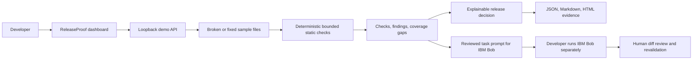

<!-- SPDX-License-Identifier: MIT; see docs/hackathon/LICENSE for this file's license. -->

# StoreReady: Global Release Passport

**One app portfolio. Every market launch. Evidence before release.**

StoreReady is a local-first release workspace for teams shipping multiple apps in multiple markets. The hackathon prototype is isolated and MIT-scoped beside the existing proprietary StoreReady product, which remains unchanged.

## Problem

Small SaaS teams track several products, countries, and distribution channels at once. Security findings, compliance evidence, store copy, local SEO, artwork, and store-specific policy checks live in separate tools. Missing or unlocalized work is easy to overlook, and generic readiness scores hide exactly what remains.

## Solution

StoreReady gives each app a separate workspace for security and release evidence, plus country-and-locale plans for Google Play, Apple App Store, Samsung Galaxy Store, web SEO, and GitHub Releases. The searchable catalogue contains 257 CLDR country/territory profiles and 585 suggested locales, with per-locale listing fields, search phrases, localized asset and privacy tasks, and a human-reviewed checklist. A connected ReleaseProof demo reads one bounded local fixture and produces deterministic findings with file/rule/scanner evidence and explicit coverage gaps. Other apps stay **Not audited** until a public GitHub repository is connected; then a bounded browser scan can sample its default branch. Its Bob handoff is designed for a real evidence-linked repository task and reviewed diff.

This demo accepts a plain public GitHub repository URL for a limited sample of at most 16 UTF-8 text files. It cannot access private repositories or certify a whole project. It does not connect store accounts, verify store availability, execute project scripts, fetch keyword rankings, translate copy, generate localized art, assess every jurisdiction, certify compliance, guarantee store approval, or publish an app. Its optional English starter-copy generator uses only the app name and a user-edited product summary; generated search phrases are heuristic suggestions, not researched keywords. CLDR locales provide locale suggestions, not translation or evidence of market demand. Market plans are local templates; unsupported scanner and policy coverage stays manual review or not assessed.

## How IBM Bob 2.0 is used

The repository includes focused task prompts for understanding the project, auditing security/testing/release/compliance, reviewing the global-market workflow, fixing reviewed blockers, and performing final verification. A developer can open the repository in IBM Bob, run one scoped task at a time, review Bob's proposed diff, run the relevant checks, and record the actual results and session-summary screenshots.

One genuine Bob Agent task has now been recorded: Bob read the public GitHub intake module, proposed and applied a one-file timeout fix after operator review, and summarized its limits. The completed-session screenshot and exported transcript are under [bob-screenshots](docs/hackathon/bob-screenshots/), with the factual record in [the usage log](docs/hackathon/BOB_USAGE_LOG.md). The other implementation work remains separate; task prompts and the in-app Bob handoff are not session proof.

## Architecture



Market plans are isolated by app and locale and stored in browser local storage. The market catalogue provides 257 country/territory profiles and 585 locale options from Unicode CLDR 48.2; the demo apps start with three, two, and two example plans. Use the market search to find a country, language, or locale and add the localized plan. Listing and search fields are editable planning drafts. An optional generator creates English starter copy from the selected app's own summary; each draft must be translated and reviewed for its target market. It does not create artwork, provide researched keyword volumes, prove storefront availability, or assess country law. See [CLDR source and license](docs/hackathon/DATA_SOURCES.md).

The local demo API only accepts a fixture selector (`broken` or `fixed`). The separate public repository intake runs entirely in the browser through GitHub's public API and limits selected file count and size; neither flow executes sample code. Existing StoreReady ZIP scanning retains its path validation, file/count/expansion limits, loopback-only development server, and security headers.

## Repeatable demo

From the repository root, run:

```powershell
node apps/releaseproof/server.mjs
```

Open [http://127.0.0.1:4173/](http://127.0.0.1:4173/). The dashboard audits `examples/releaseproof/broken-app`. Open another app, connect a public GitHub repository, and run a bounded default-branch static scan; its score stays unscored and coverage limits remain visible. Open **Markets** to review per-app country/locale plans, search the CLDR-backed catalogue, generate an English starter draft from a product summary, edit locale-specific fields, mark reviewed launch evidence, and export a JSON brief. Generated search phrases are not keyword research; native translation, artwork, marketplace availability, and compliance tasks remain human-reviewed. Select **Prepare fix with IBM Bob** to create a prompt for a real Bob session. The fixture switch is sample data, not a code edit or Bob usage.

Run the measured fixture benchmark with:

```powershell
node apps/releaseproof/benchmark.mjs
```

The benchmark prints the actual check count, fixture file count, blocker counts, and local audit durations for that run. It makes no speed or productivity claim.

## Existing StoreReady workflow

The root package remains StoreReady v2. The existing CLI, Android/store assurance engine, evidence normalization, bounded worker/service architecture, runtime lab, and report generation remain in place. Useful commands include:

```powershell
npm test
npm run test:releaseproof
npm run verify
npm run release:gate
npm run scan:demo
```

See [ARCHITECTURE.md](ARCHITECTURE.md), [autonomous assurance](docs/AUTONOMOUS_ASSURANCE.md), and [security](SECURITY.md) for the existing product model.

## Security limits

The ReleaseProof fixture audit reads only the checked-in sample fixture. Public scans use a separate bounded GitHub API intake and browser scanner; at most 16 small UTF-8 files are read from the default branch, and other files remain unassessed. Both flows enforce path and size limits, redact credential-shaped source evidence, and never shell out or import scanned source. Static checks can miss issues and produce false positives. Dependency advisory and platform compliance coverage are unavailable in the public profile.

## Hackathon submission readiness

- **Demo platform:** GitHub Pages static demo plus the standalone local Node.js app in `apps/releaseproof/`.
- **Working local URL:** `http://127.0.0.1:4173/` while `node apps/releaseproof/server.mjs` is running.
- **Public working URL:** https://kapasainitishreddy.github.io/store-ready-global-release-passport/ (GitHub Pages deployment verified; hosted audit uses scanner-derived fixture snapshots).
- **Public code repository:** https://github.com/kapasainitishreddy/store-ready-global-release-passport (standalone MIT-scoped package).
- **License:** the parent StoreReady repository is proprietary (`UNLICENSED`). Original ReleaseProof code, sample fixtures, Bob prompts, and contributor-created hackathon documents have scoped MIT notices. CLDR data and the authentic IBM Bob UI screenshot have separate rights noted in [third-party notices](docs/hackathon/THIRD_PARTY_NOTICES.md). The parent repository itself remains private.
- **IBM Bob screenshots:** one authentic completed-task capture is present. Attribute it to the signed-in operator and obtain a separate summary from every other participating member using [the screenshot guide](docs/hackathon/bob-screenshots/README.md).
- **Cover image:** a real local browser capture of the blocked audit is saved as `docs/hackathon/cover.jpg`; `docs/hackathon/market-workspace.jpg` shows the country planning view.
- **Final checklist:** [docs/hackathon/CHECKLIST.md](docs/hackathon/CHECKLIST.md) marks completed local items and the external items still due.
- **Video and slides:** scripts are in [DEMO_SCRIPT.md](docs/hackathon/DEMO_SCRIPT.md) and [SLIDES.md](docs/hackathon/SLIDES.md); recording and visual slide production remain manual.

## Hackathon

IBM Bob 2.0 Hackathon · September 25–27, 2026 · submission deadline September 27, 2026 at 11:00 AM ET.

This project is a local prototype of per-app, per-market release operations, not an exhaustive security/compliance service or store-approval guarantee.
