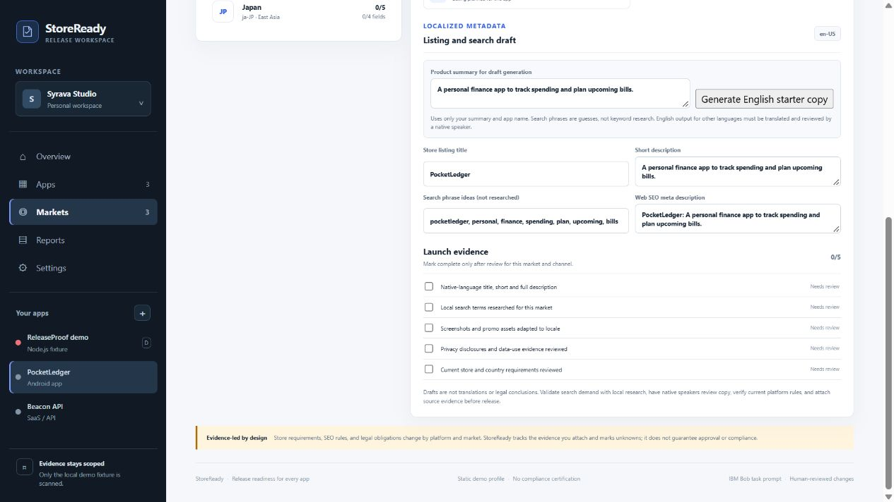

# StoreReady — Global Release Passport

StoreReady helps a team keep multiple apps' launch work separate while organizing release evidence and market plans in one workspace. The prototype combines a bounded static audit of an included Node.js fixture, a limited public GitHub repository scan, and per-app launch planning across five channels: Google Play, Apple App Store, Samsung Galaxy Store, web SEO, and GitHub Releases.

The searchable market catalogue has 257 Unicode CLDR country/territory profiles and 585 locale plans. The sample apps start with a few plans to make the workflow easy to explore. Listing/search fields are editable planning drafts. An optional generator drafts English listing and SEO copy from the app name and editable product summary; search phrases are heuristic ideas, not keyword research. Drafts need human editing and native translation before use. Checklists track asset adaptation, privacy review, local research, and store-policy review. Plans save in this browser and can be exported as JSON.

Regenerate the checked-in catalogue with `npm run build:market-catalog`. Its CLDR 48.2 source files and separate Unicode license are in `apps/releaseproof/data/cldr/`. The language list is a planning suggestion and does not verify store availability, legal requirements, translation quality, or search demand; see `docs/hackathon/DATA_SOURCES.md`.

## Run

Requires Node.js 22.5 or newer. No dependencies need to be installed.

```sh
npm start
```

Open <http://127.0.0.1:4173/>. The ReleaseProof demo app scans the bundled deliberately broken fixture. Other sample apps stay **Not audited** until you enter a public GitHub repository URL on their overview and run the bounded scan. Switch to **Markets**, select PocketLedger, and compare the US, India, and Japan plan surfaces. App/platform mismatches such as Apple App Store for an Android-only app are marked not applicable.



## Verify

```sh
npm test
```

The GitHub Pages demo replays JSON snapshots generated by the bundled scanner for its two fixture states. For another app, the browser reads up to 16 UTF-8 files of at most 256 KiB each from a public GitHub repository's default branch through the GitHub API and runs a narrower static profile locally in the browser. It records sampling and unsupported checks as coverage gaps and does not score public scans. The local Node.js app runs the fixture scanner directly. Neither flow executes project commands. Public scans do not support private repositories, whole-repository security assessment, dependency advisories, mobile policy review, or legal compliance conclusions. The market planner does not verify store availability, provide native translations, generate artwork, provide researched keyword volume, certify compliance, or publish to stores.

## IBM Bob

The `bob/tasks/` directory contains scoped task prompts. Prompts are not evidence that IBM Bob was used. The submission usage log and per-member task-session screenshots must be completed only after real IBM Bob sessions. The app's prompt builder does not invoke Bob.

## License

The original ReleaseProof code, demo fixtures, and contributor-created hackathon writing are MIT-licensed. Unicode CLDR data retains its separate license, and authentic IBM Bob UI screenshots are included as usage evidence rather than relicensed artwork; see `docs/hackathon/THIRD_PARTY_NOTICES.md`. The parent StoreReady implementation is proprietary and is not included. GitHub Actions publishes the interactive static demo from `apps/releaseproof/public/` after deriving the fixture snapshots and running the focused tests.
